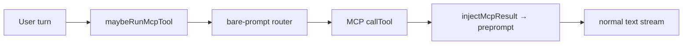
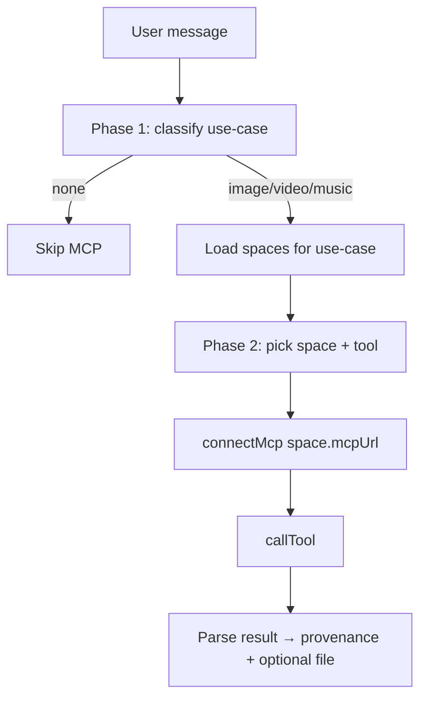

# HF Spaces MCP Integration Plan

## Current state

The chat already has a **fail-open, pre-stream MCP path** that is separate from the stripped upstream in-stream tool loop:



Key files today:
- Orchestration: [`chat-svelte/src/lib/server/mcp/index.ts`](chat-svelte/src/lib/server/mcp/index.ts) — gated by single env var `SPACE_MCP_URL`
- Router: [`chat-svelte/src/lib/server/mcp/router.ts`](chat-svelte/src/lib/server/mcp/router.ts) — one non-streaming `tools` call on bare prompt
- Provenance pattern to mirror: RAG in [`chat-svelte/src/routes/conversation/[id]/+server.ts`](chat-svelte/src/routes/conversation/[id]/+server.ts) (stamp message + stream `MessageUpdateType.Rag` before generation)
- Stack map already has a placeholder node `imagegen` (`st: "wanted"`) in [`chat-svelte/static/data/stack-map.json`](chat-svelte/static/data/stack-map.json)

**Gap:** one Space URL, no use-case routing, no provenance fields/UI, no inline media attachment.

---

## 1. Editable registry file

Add a committed, human-editable config at **`chat-svelte/static/data/mcp-spaces.json`** (same family as `stack-map.json` and `routes.chat.json`).

Proposed shape:

```json
{
  "version": 1,
  "useCases": [
    {
      "id": "image",
      "label": "Image generation",
      "mapNodeId": "imagegen",
      "routingHint": "User wants to create, edit, or transform an image from a text prompt.",
      "spaces": [
        {
          "id": "flux-schnell",
          "label": "FLUX Schnell",
          "owner": "black-forest-labs",
          "mcpUrl": "https://….hf.space/gradio_api/mcp/",
          "spaceUrl": "https://huggingface.co/spaces/…",
          "default": true,
          "timeoutMs": 120000,
          "resultKind": "image"
        }
      ]
    },
    {
      "id": "video",
      "label": "Video generation",
      "mapNodeId": "videogen",
      "routingHint": "…",
      "spaces": [ … ]
    },
    {
      "id": "music",
      "label": "Music generation",
      "mapNodeId": "musicgen",
      "routingHint": "…",
      "spaces": [ … ]
    }
  ]
}
```

**Loader + validation:** new [`chat-svelte/src/lib/server/mcp/registry.ts`](chat-svelte/src/lib/server/mcp/registry.ts) with a Zod schema. Load JSON at server startup; export typed `getMcpRegistry()`, `mcpEnabled()` (true when ≥1 space configured), and helpers to resolve spaces by use-case.

**Dev override:** keep `SPACE_MCP_URL` as an optional escape hatch — when set, synthesize a single-space `image` use-case so existing deploys keep working until the JSON is populated.

**Docs:** short [`chat-svelte/docs/mcp-spaces.md`](chat-svelte/docs/mcp-spaces.md) explaining how to add a Space (find MCP URL, set `resultKind`, link `mapNodeId`).

---

## 2. Multi-space routing (two-phase)

Replace the current “connect one URL, route one tool” flow with:



**Phase 1 — use-case classifier** (new `classifyUseCase()` in [`router.ts`](chat-svelte/src/lib/server/mcp/router.ts)):
- Non-streaming bare-prompt call with a small static tool per use-case (e.g. `invoke_image_generation`, `invoke_video_generation`, `invoke_music_generation`) and `routingHint` as description.
- Temperature 0, fail-open → `null`.

**Phase 2 — space + tool selection** (extend `routeToolCall`):
- Connect only to spaces in the chosen use-case (parallel `listTools` if multiple; prefer `default: true` space when router is ambiguous).
- Namespace tool names as `{spaceId}__{toolName}` in the OpenAI schema to avoid collisions across Spaces; strip prefix before `callTool`.
- Reuse existing [`schema.ts`](chat-svelte/src/lib/server/mcp/schema.ts) `_noop` workaround for no-param tools.

**Timeouts:** per-space `timeoutMs` with connect/call wrapped in `Promise.race` (default 120s). Log and fail-open on timeout.

**Auth:** optional per-space `authHeaderEnv` (e.g. `"HF_TOKEN"`) passed to `connectMcp` headers — needed for private or rate-limited Spaces.

Refactor [`maybeRunMcpTool`](chat-svelte/src/lib/server/mcp/index.ts) → `maybeRunMcpTools()` returning enriched result:

```ts
type McpInvocation = {
  useCaseId: string;
  spaceId: string;
  spaceLabel: string;
  spaceUrl: string;
  mapNodeId: string;
  tool: string;
  args: Record<string, unknown>;
  resultKind: "text" | "image" | "video" | "audio";
  resultText?: string;      // grounding for model
  resultUrl?: string;       // persisted provenance + fetch for inline file
  asOf: string;
};
```

---

## 3. Result handling and inline media

**Parser** (new `parseMcpResult.ts`):
- Inspect MCP `content` blocks: text, image (URL/base64), resource URIs.
- Map via space `resultKind` when the Space returns opaque text containing a URL.
- For `image` / `video` / `audio`: extract URL or base64; server-fetch URL via existing [`downloadFile.ts`](chat-svelte/src/lib/server/files/downloadFile.ts) pattern; attach to assistant message as `MessageFile` (`type: "hash"` after upload, or `base64` for small payloads).
- Truncate/limit persisted `resultText` in provenance (full blob stays server-only grounding, same pattern as RAG `evidence`).

**Grounding injection:** extend `injectMcpResult()` to include use-case/space attribution and a short result summary (not raw binary).

**Chat UI:** [`ChatMessage.svelte`](chat-svelte/src/lib/components/chat/ChatMessage.svelte) already renders `message.files` — generated assets appear inline automatically once stamped. Add a small caption component if the file name alone is unclear (e.g. “Generated via FLUX Schnell”).

---

## 4. Provenance data model

### Persisted on `Message`

Add to [`Message.ts`](chat-svelte/src/lib/types/Message.ts):

```ts
mcpTools?: {
  useCaseId: string;
  useCaseLabel: string;
  invocations: Array<{
    spaceId: string;
    spaceLabel: string;
    spaceUrl: string;
    mapNodeId: string;
    tool: string;
    resultKind: "text" | "image" | "video" | "audio";
    resultUrl?: string;
    asOf: string;
  }>;
};
```

### Stamp authority

Add `mcpProvenance()` to [`messageProvenance.ts`](chat-svelte/src/lib/messageProvenance.ts) — same dual-write contract as `searchProvenance` / `ragProvenance`.

### Stream update

Add `MessageUpdateType.McpTool` + `MessageMcpToolUpdate` in [`MessageUpdate.ts`](chat-svelte/src/lib/types/MessageUpdate.ts).

Wire in [`+server.ts`](chat-svelte/src/routes/conversation/[id]/+server.ts) **before** `textGeneration()` (parallel to RAG block ~L804–822):
1. Run `maybeRunMcpTools(userText)`
2. Stamp `messageToWriteTo.mcpTools`
3. Attach files if any
4. `await update({ type: MessageUpdateType.McpTool, … })`

Client mirror in [`+page.svelte`](chat-svelte/src/routes/conversation/[id]/+page.svelte) (parallel to RAG handler ~L635).

Pass MCP grounding into `textGeneration` via context or by running MCP inside `textGeneration/index.ts` **before** `generate()` — prefer moving orchestration to `+server.ts` for provenance streaming, and pass `mcpContext` into `TextGenerationContext` so preprompt injection still happens in one place.

---

## 5. “How this answer was made” UI

Extend [`ProvenanceTrace.svelte`](chat-svelte/src/lib/components/chat/ProvenanceTrace.svelte):

- New step kind **`create`** (between `retrieve` and `generate` when MCP ran):
  - Dot color: `var(--ap-live)` (active open component, like retrieval)
  - Pipeline order: `retrieve` → `create` → `generate` → `verify`
- New component **`McpToolStrip.svelte`** (parallel to `SourceStrip` / `RagSourceStrip`):
  - Shows use-case label, space name (link to `spaceUrl`), tool name
  - Thumbnail for images; compact player links for video/audio
  - `ap:flash` dispatch to `mapNodeId` on click

Update `computePulseNodes()` in [`reveal.ts`](chat-svelte/src/lib/components/stack/reveal.ts) to include MCP map nodes while streaming when `message.mcpTools` is set.

Update `computeRevealStages()` to append MCP nodes after retrieval, before model nodes.

Add constants:

```ts
export const IMAGEGEN_NODE = "imagegen";
export const VIDEOGEN_NODE = "videogen";
export const MUSICGEN_NODE = "musicgen";
```

Extend `ALL_STACK_NODE_IDS` and `reveal.spec.ts` assertions.

---

## 6. “Under the hood” stack map

Update [`stack-map.json`](chat-svelte/static/data/stack-map.json) Tools layer:

| Node id | Change |
|---------|--------|
| `imagegen` | `st: "live"`, copy reflects configured Spaces |
| `videogen` | **new** node, `st: "live"` when registry has video spaces |
| `musicgen` | **new** node, `st: "live"` when registry has music spaces |

Node `d` strings can reference `{mcpSpacesSummary}` token — resolve at load time in [`StackMap.svelte`](chat-svelte/src/lib/components/stack/StackMap.svelte) from registry (e.g. “Wired: FLUX Schnell, Stable Diffusion XL”).

Expose registry summary via [`+layout.server.ts`](chat-svelte/src/routes/+layout.server.ts) alongside `servingProvenance` so the map header stays honest about what is actually configured.

---

## 7. Testing and evals

| Test | File |
|------|------|
| Registry Zod validation + `SPACE_MCP_URL` fallback | `mcp/registry.spec.ts` |
| Tool namespacing round-trip | extend `schema.spec.ts` |
| `mcpProvenance()` shape + honesty gates | `messageProvenance.spec.ts` |
| `computeRevealStages` with MCP nodes | extend `reveal.spec.ts` |
| Live probe against configured Space | extend [`evals/mcp-live-probe/run.ts`](chat-svelte/evals/mcp-live-probe/run.ts) to accept registry space id |

Add **fixture JSON** with one placeholder Space per use-case (commented or `enabled: false`) so CI validates schema without calling live Spaces.

---

## 8. Environment and rollout

- Add to [`.env.example`](.env.example) / [`chat-svelte/.env.ci`](chat-svelte/.env.ci): note that MCP Spaces are configured via `static/data/mcp-spaces.json`; `SPACE_MCP_URL` remains optional dev override.
- Populate `mcp-spaces.json` with your curated Space list (you provide final URLs).
- Deploy: no new secrets required for public Spaces; set `HF_TOKEN` if Spaces need auth.

---

## Implementation order

1. **Registry file + loader** — editable config, validation, `mcpEnabled()` migration
2. **Two-phase router + enriched invocation result** — replace single-URL path
3. **Provenance types + stamp + stream update** — server/client parity
4. **Result parser + file attachment** — inline media
5. **ProvenanceTrace + McpToolStrip + reveal.ts** — “How this answer was made” + map pulse/reveal
6. **stack-map.json + layout summary** — “Under the hood”
7. **Tests, docs, eval probe**

---

## Out of scope (defer)

- Restoring upstream in-stream multi-turn tool loop (“Commit B” in `toolSearch.ts`)
- User-facing MCP server picker (`selectedMcpServers` dead code)
- Multiple MCP invocations per turn (architecture supports array; v1 runs at most one)
- Private Space OAuth per-user (use shared `HF_TOKEN` only)
