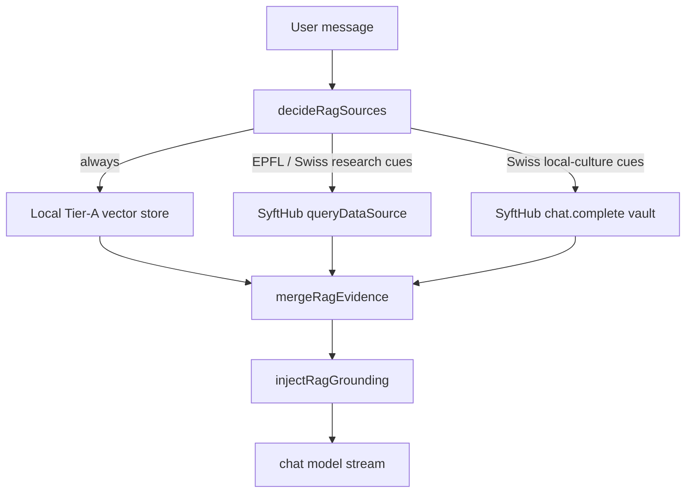

# RAG stores

The chat grounds answers on three retrieval-augmented stores, selected per turn by
a server-side auto-router. The whole feature is additive and fail-open: a missing
index, a missing token, or any remote failure is logged and skipped, and the chat
answers normally.



## The three stores

| Store | Module | Source | Shape |
|-------|--------|--------|-------|
| Local catalog (Potluck) | `src/lib/server/rag/localStore.ts` | Pre-embedded Tier-A index (categories, exemplar repos, stack-map, project blurb) | Cited snippets `[n]` |
| EPFL News | `src/lib/server/rag/syftEpfl.ts` | OpenMined SyftHub `syftai.queryDataSource` over the paid `epfl-news` endpoint | Cited snippets `[n]` |
| Local-culture vault | `src/lib/server/rag/syftVault.ts` | OpenMined SyftHub `chat.complete` against a federated agent | Synthesized answer (attributed, not cited) |

The vault returns a privacy-filtered synthesis rather than raw documents, so it is
grounded separately and the model is told not to claim it read the private data.

## Orchestration

`maybeRagGrounding(query, locals)` in `src/lib/server/rag/index.ts` is the single
entry point, called from `src/routes/conversation/[id]/+server.ts` (after the safety
pre-screen, before `textGeneration`) so retrieval results can be persisted on the
assistant message and streamed to the client. Inside `textGeneration`, `injectRagGrounding`
uses the pre-fetched `ctx.ragContext`. The orchestrator:

1. Gates on `RAG_ENABLED`.
2. Routes via `decideRagSources` — keyword heuristics (`router.ts`), with an
   optional model classifier when `RAG_CLASSIFIER_ENABLED=true`.
3. Fetches the selected stores in parallel (each with its own timeout).
4. Merges the results into one grounding context and injects it
   (`textGeneration/ragGrounding.ts`).

## Configuration

Set these in `chat-svelte/.env.local` (all are read via the config proxy and are
optional — unset values disable the relevant path):

```env
RAG_ENABLED=true
RAG_EMBEDDING_MODEL=sentence-transformers/all-MiniLM-L6-v2
RAG_EMBEDDING_BASE_URL=https://router.huggingface.co/hf-inference/models
RAG_TOP_K=5
RAG_MIN_SCORE=0.35
RAG_CLASSIFIER_ENABLED=

SYFTHUB_API_TOKEN=syft_pat_...
SYFTHUB_BASE_URL=https://syfthub.openmined.org
SYFTHUB_USER_EMAIL=you@example.com
SYFTHUB_EPFL_ENDPOINT_URL=http://20.0.5.93:8081
SYFTHUB_EPFL_SLUG=epfl-news
SYFTHUB_EPFL_OWNER=epfl-news
SYFTHUB_VAULT_MODEL=irina11/test-user-data
```

The embedding endpoint reuses `OPENAI_API_KEY` (or `HF_TOKEN`). The HF router's
`/v1` API has no `/embeddings`, so the local store embeds through the HF Inference
feature-extraction endpoint (`{base}/{model}/pipeline/feature-extraction`).

### OpenMined SyftHub setup

The federated stores need a SyftHub account:

1. Create an account at https://syfthub.openmined.org.
2. Go to Settings -> API Token -> Create Token and put it in `SYFTHUB_API_TOKEN`.
3. Go to Settings -> Wallet -> Create Wallet to get a testnet balance — the EPFL
   endpoint charges per query and the SDK settles the payment automatically
   (`pay: true`).

Without a token both federated stores stay off and only the local catalog store runs.

## Building the local index

The index is committed at `src/lib/server/rag/data/rag-index.json` so CI and deploys
need no embedding key. Rebuild it when the Tier-A data changes:

```bash
npm run build:rag-index     # re-embed and write the index (needs OPENAI_API_KEY/HF_TOKEN)
npm run check:rag-index     # assert the committed index is non-empty + dimensions match (CI)
```

If you change `RAG_EMBEDDING_MODEL`, rebuild the index so its dimensions match the
query embeddings (the store skips silently on a dimension mismatch).

## Uploading to the vault (out of band)

The vault's documents are uploaded directly to the data node, not through the chat.
From the launch notebook:

```bash
curl -X POST http://74.161.162.161:8082/upload \
  -H "Authorization: Bearer <upload-token>" \
  -F "identifier=<session-or-canton-id>" \
  -F "file=@<file_path>"
```

## Tests

```bash
npx vitest run src/lib/server/rag
```

Covers the router heuristics + classifier parsing (`router.spec.ts`), evidence
merging, cosine similarity, and the EPFL document parser (`merge.spec.ts`).

## Provenance UI

When RAG retrieval succeeds, the assistant message carries a `rag` provenance marker
(stamped server-side via `ragProvenance()`, mirrored optimistically on the
`MessageUpdateType.Rag` stream event). The UI surfaces it in three places:

| Surface | What the guest sees |
|---------|---------------------|
| **How this answer was made** (`ProvenanceTrace`) | A `retrieve` step with `RagSourceStrip` (numbered catalog/EPFL sources) and `VaultSynthesisNote` when the vault ran (synthesis is attributed, not a numbered citation) |
| **Under the hood** (`StackMap`) | Per-store nodes light in pipeline order: `websearch` → `potluck-rag` / `syft-epfl` / `localculture` → `apertus` (+ `cscs` when sovereign-served) |
| **Inline citations** (`ChatMessage`) | `[n]` markers link through web sources first, then RAG sources (offset when both ran) |

Map node ids live in `static/data/stack-map.json`; reveal logic is centralized in
`src/lib/components/stack/reveal.ts` (`computeRevealStages`, `computePulseNodes`).
